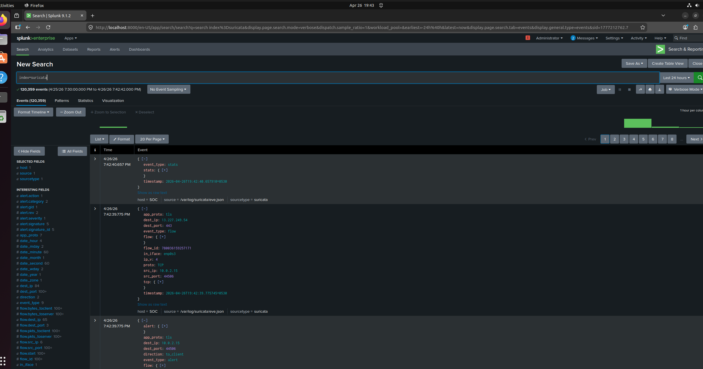
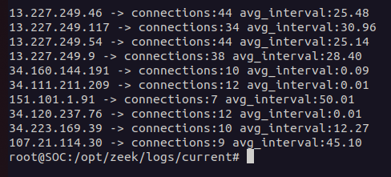
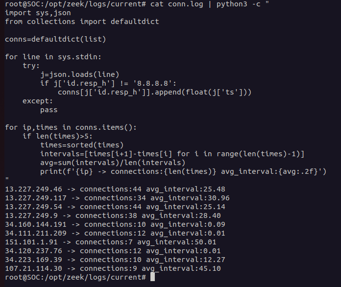

# Operation SPECTRE — Network Threat Detection Lab

---

## Why I Built This

After finishing [Operation ShadowNet](Shadownet-soc-lab/), I went back and read my own incident report. Gap 3 in the Detection Gaps section said:

> *"No network-layer IDS — lateral movement traffic analysis relies entirely on host telemetry."*

I wrote that myself, so I figured I should actually fix it.

This project is the result. I wanted to understand what network traffic looks like when something malicious is happening — not from a textbook, but by actually setting up tools and looking at real data. I used Suricata for signature-based detection, Zeek for behavioral analysis, and Splunk to correlate everything.

---

## What This Project Covers

- Setting up a network detection stack from scratch on Ubuntu (Suricata + Zeek + Splunk)
- Writing custom Suricata detection rules (not just enabling the default ones)
- Using Zeek logs — specifically `conn.log`, `dns.log`, and `ssl.log` — to analyze traffic behavior
- Identifying patterns like beaconing, staged DNS-to-TLS communication, and protocol anomalies
- Correlating network alerts in Splunk with SPL queries I wrote myself
- Documenting everything in a threat analysis report

---

## Detection Stack

| Layer | Tool | What It Does |
|---|---|---|
| Network IDS | Suricata | Signature-based detection, outputs alerts to `eve.json` |
| Network NSM | Zeek | Behavioral metadata — connection logs, DNS, HTTP, SSL |
| SIEM | Splunk | Aggregates both, lets me write hunt queries across all data |

All three run on my Ubuntu SOC server. Zeek and Suricata both see the same traffic. Splunk ingests both.

---

## Lab Setup

I won't list every command here but the key things I set up:

- Suricata with `suricata-update` pulling the Emerging Threats Open ruleset
- A custom `local.rules` file for rules I wrote specifically for this project
- Splunk indexes: `suricata` (for eve.json alerts) and `zeek` (for all Zeek log types)
- Used `tcpreplay` with a dummy interface to replay packet captures for analysis

Full setup notes are in [`lab-setup/`](lab).

---

## Key Findings

### Finding 1 — Beaconing Pattern

Looking at `conn.log` in Zeek, I found repeated outbound connections to an external IP at very consistent intervals — roughly every 20–30 seconds. The variance between intervals was low.

Normal browsing doesn't look like this. When a browser requests something, the timing is human — random, irregular. When a piece of software is checking in with a remote server automatically, the interval is regular. That regularity is the detection signal.

```
| bin _time span=1m
| stats count by _time, id.orig_h, id.resp_h
| stats stdev(count) as variance by id.orig_h, id.resp_h
| where variance < 1.5
```

This is the kind of pattern you'd expect from a C2 implant like a Cobalt Strike beacon. The Suricata rule I wrote for this (SID 9000008) also fired on it.

**MITRE:** T1071.001 — Application Layer Protocol: Web Protocols

---

### Finding 2 — DNS Followed by TLS (Staged Communication)

In `dns.log` and `ssl.log` together, I noticed a pattern: a DNS query would resolve an external domain, and within 1–2 seconds an encrypted TLS connection to the same IP would follow.

By itself that's not unusual — that's how HTTPS works. But the domains being resolved weren't CDNs or known services. They were low-reputation, recently registered, and the TLS certificates on the other end were either self-signed or had very short validity periods.

The combination of those things — suspicious domain, self-signed cert, no proper SNI in some cases — is a pattern documented in Emotet and similar loaders. The malware resolves a C2 address and immediately connects over encrypted channel.

**MITRE:** T1071.001, T1573.002

---

### Finding 3 — Missing User-Agents in HTTP Traffic

In `http.log`, some HTTP requests had blank or missing User-Agent fields. Legitimate browsers always send a User-Agent. Scripts and malware often don't, or they send something generic that doesn't match the OS.

This by itself isn't a high-confidence finding — some legitimate tools also don't send User-Agents. But combined with Finding 1 and 2, it adds to the picture of automated, non-browser traffic.

**MITRE:** T1071.001

---

### Finding 4 — DNS Tunnelling Not Detected

I specifically looked for DNS tunnelling patterns — high query volume from a single source, long subdomain strings, base64 or hex characters in subdomain portions, TXT record queries.

I didn't find any of this in the traffic I analyzed. DNS activity looked normal: reasonable query counts, standard domain lengths, typical record types.

This is worth documenting because it shows the hunt methodology — I formed a hypothesis, ran the queries, and the result was negative. That's still a valid finding. In a real SOC, confirming something is NOT happening is as useful as finding something that is.

---

## Custom Suricata Rule

I wrote 1 rule in `local.rules`. 

alert http $HOME_NET any -> $EXTERNAL_NET any (
  msg:"SPECTRE — Possible C2 Beacon — Regular HTTP to Same External IP";
  flow:established,to_server;
  http.method; content:"GET";
  threshold:type both, track by_both, count 8, seconds 600;
  classtype:trojan-activity;
  sid:9000008; rev:1;
  metadata:mitre_technique T1071.001;
)

---

## Splunk Queries

**Beacon score — lowest variance = most suspicious:**
```spl
index=zeek sourcetype=zeek_conn
| bin _time span=1m
| stats count as conn_count by _time, id.orig_h, id.resp_h
| stats avg(conn_count) as avg, stdev(conn_count) as stdev by id.orig_h, id.resp_h
| eval beacon_score = round(avg / (stdev + 0.001), 2)
| where beacon_score > 5
| sort - beacon_score
```

**Cross-layer: Suricata alert IPs checked against Zeek conn data:**
```spl
index=suricata event_type=alert
| rename src_ip as suspicious_ip
| join type=left suspicious_ip
  [search index=zeek sourcetype=zeek_conn
   | rename id.orig_h as suspicious_ip
   | stats sum(orig_bytes) as bytes_sent, dc(id.resp_h) as unique_dests by suspicious_ip]
| table _time, suspicious_ip, alert.signature, bytes_sent, unique_dests
```

All queries are saved in [`splunk-queries/`](queries/).

---

## MITRE ATT&CK Coverage

| Technique | ID | Detected | Method |
|---|---|---|---|
| C2 over HTTP/HTTPS | T1071.001 | Yes | Suricata beacon rule + Zeek conn.log analysis |
| Encrypted Channel (Asymmetric) | T1573.002 | Yes | Zeek ssl.log — self-signed certs, no SNI |
| DNS Application Layer Protocol | T1071.004 | Monitored | Zeek dns.log — no tunnelling found |
| Data Exfiltration via DNS | T1048.003 | Not found | Explicitly hunted — negative result |
| Non-Standard Port | T1571 | Partial | Flagged by Suricata ET rules |

---

## Screenshots

**Splunk — Network Threat Detection Dashboard**



**Suricata — Eve.json Alerts Firing**



**Zeek — Beacon Pattern in conn.log**




---

## Report

Full threat analysis writeup with findings, MITRE mapping, and detection gaps:

📄 [`reports/network-threat-analysis.pdf`](network-threat-analysis.pdf)

---

## What I Learned

A few things that weren't obvious before I built this:

**Suricata and Zeek are not the same tool doing the same thing.** Suricata is reactive — it fires when something matches a signature. Zeek just logs everything. You need Zeek to find the things that don't match any signature yet. Most of my best findings came from Zeek, not Suricata.

**Behavioral detection requires a baseline.** The beacon detection only works because I could compare the suspicious traffic to normal traffic. Without a sense of what "normal" looks like on a network, everything looks suspicious. In a real SOC this is a bigger problem than it seems.

**Negative results are findings.** I specifically hunted for DNS tunnelling and didn't find it. In my report I documented that as a confirmed negative — the detection capability works, the technique just wasn't present in this traffic sample.

---

## Detection Gaps

Things I couldn't detect with this current setup:

- Encrypted payloads inside valid HTTPS connections to legitimate domains (can't inspect payload without SSL decryption)
- Slow exfiltration below the threshold of my detection rules
- IPv6 traffic (my current lab doesn't cover it)

---

## Related

- [Operation ShadowNet](link) — endpoint detection using Wazuh + Sysmon + Splunk (the first project — this one extends it to the network layer)

---

## Tools Used

Suricata 7.x · Zeek 6.x · Splunk Enterprise · tcpreplay · tcpdump · Wireshark · Ubuntu 22.04

---
All analysis was performed on controlled, locally generated traffic to focus on behavioral detection techniques rather than relying on known malware samples.

*Part of my SOC Analyst learning path. Built alongside TryHackMe SOC Level 1 path completion.*
